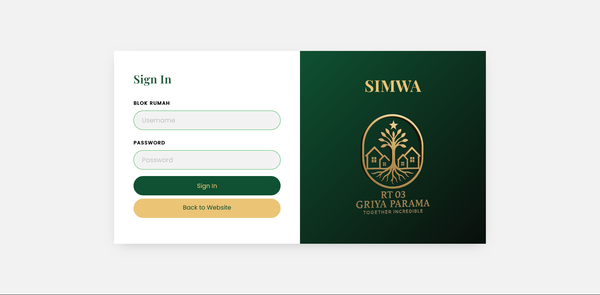

# 🏠 SIMWA — Sistem Informasi Manajemen Warga

[](https://www.java.com/)
[](https://spring.io/)
[](https://midtrans.com/)
[](https://www.postgresql.org/)
[](LICENSE)

**SIMWA** adalah aplikasi berbasis **Spring MVC + jQuery** yang dirancang untuk membantu pengelolaan data warga dan pembayaran iuran secara **efisien, transparan, dan mudah digunakan**.  
Aplikasi ini terintegrasi dengan **Midtrans Payment Gateway** untuk mendukung pembayaran online yang aman dan praktis.

---

## 🚀 Fitur Utama

- 👥 **Manajemen Data Warga (CRUD)**
- 💰 **Pembayaran Iuran Online** via Midtrans Snap API
- 🔑 **Validasi Signature Key** untuk keamanan transaksi
- 📊 **Dashboard Admin** untuk memantau status pembayaran
- ⚙️ **AJAX & jQuery** untuk tampilan interaktif dan dinamis
- 🧾 **Integrasi Database PostgreSQL**

---

## 🧱 Teknologi yang Digunakan

| Kategori | Teknologi |
|-----------|------------|
| **Backend** | Java, Spring MVC, Spring Boot (opsional) |
| **Frontend** | HTML, CSS, Bootstrap, jQuery, AJAX |
| **Database** | PostgreSQL |
| **Payment** | Midtrans Payment Gateway |
| **Version Control** | Git & GitHub |

---

## ⚙️ Cara Instalasi

1. **Clone repository**
   ```bash
   git clone https://github.com/suryasamp/simwa.git
   cd simwa
   
2. **Konfigurasi application.properties**<br>
   Tambahkan di application.properties:
   ```
   #Configurasi Database
   spring.datasource.url=jdbc:postgresql://localhost:5432/simwa_db
   spring.datasource.username=postgres
   spring.datasource.password=your_password

   #Configurasi Midtrans
   midtrans.server.key=YOUR_SERVER_KEY
   midtrans.client.key=YOUR_CLIENT_KEY
   midtrans.is_production=false

   # Optional JPA settings
   spring.jpa.hibernate.ddl-auto=update
   spring.jpa.show-sql=true
   spring.jpa.database-platform=org.hibernate.dialect.PostgreSQLDialect

   # Path folder upload, bisa diubah sesuai server
   file.upload-dir=C:/simwa3/uploads

   # Multipart file size limit
   spring.servlet.multipart.max-file-size=10MB
   spring.servlet.multipart.max-request-size=20MB

3. **Jalankan aplikasi**
   ```bash
   mvn spring-boot:run
   ```
   Lalu buka di browser: [http://localhost:8080](http://localhost:8080)

---

## 📸 Tampilan

| Login Page | Dashboard |
|-------------|------------|
|  |


---


## 🌟 Dukungan

Jika **SIMWA** membantu kamu memahami integrasi **Midtrans** atau membangun sistem warga,  
beri ⭐ di repo ini — itu sangat membantu pengembang terus memperbarui proyek ini 🙌


---

### 🔗 Kontak
📧 Email: [surya.samp@gmail.com]  
📍 Developer: [Surya Adimulya Pratama](https://github.com/suryasamp)

---

   
 
